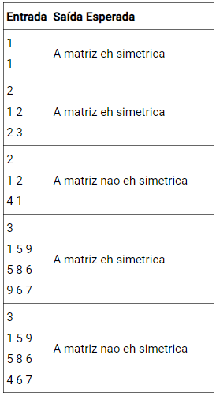

 

# Questão 01 - (Adaptada do beecrowd/1040)
Escreva um programa que recebe como entrada três números reais, correspondente às notas de um estudante, calcule a média aritmética destas notas, e a apresente com uma casa decimal após a mensagem "Media: ". Se a média for maior ou igual a 7.0, imprima a mensagem "Aluno aprovado" na linha seguinte. Se amédia for igual ou inferior a 3.0, imprima a mensagem "Aluno reprovado". Caso contrário, o programa deve exibir a mensagem "Aluno em recuperação".

No caso do aluno estar em recuperação, o programa recebe outro valor real correspondente à nota da prova obtida pelo aluno. Imprima então mensagem "Nota da prova: " acompanhada pela nota digitada. Recalcule a média (some a pontuação do exame com a média anteriormente calculada e divida por 2) e imprima a mensagem "Aluno aprovado" caso a média final seja 5.0 ou mais, ou "Aluno reprovado", caso a média tenha ficado 4.9 ou menos. Para estes dois casos (aprovado ou reprovado após ter pego exame) apresente na última linha uma mensagem "Media final: " seguido da média final para esse aluno. 

|Exemplo de entrada | Exemplo de saída |
|-------------------|------------------|
|8.0 6.5 7.4 | Media: 7.3 Aluno aprovado|
|2.0 4.0 7.5 8.0 | Media: 4.5 Aluno em recuperação. Nota da prova: 8.0 Aluno aprovado. Media final: 6.3 |
|1.5 4.0 3.5 | Media: 3.0 Aluno reprovado | 

# Questão 02 - (Adaptada do beecrowd/1041)
Escreva um programa que recebe dois valores reais(x , y), representando as coordenadas de um ponto em um plano cartesiano. A seguir, determine qual o quadrante ao qual pertence o ponto, ou se está sobre um dos eixos cartesianos ou na origem (x = y = 0)
Se o ponto estiver na origem, escreva a mensagem "Origem"
Se o ponto estiver sobre um dos eixos escreva "Eixo X" ou "Eixo Y".

|Exemplo de entrada | Exemplo de saída | 
|-------------------|------------------|
| 4.5 -2.2           | Q4                |
| 0.1 0.1 | Q1 |
| 0 0 | Origem | 
| 0 1 | Eixo Y |

# Questão 3 
Um jovem decidiu viajar pelo mundo e comprou uma mochila com capacidade para 20kg de carga. Para abastecer esta mochila, o jovem deve selecionar itens de uma sequência de n objetos forncecidos. As regras de seleção adotada pelo jovem foram as seguintes: 
   1. A decisão de inserir ou não um objeto na mochila é tomada à medida em que os objetos vão sendo fornecidos na sequência. Em outras palavras, obdecendo a ordem da sequência.
   2. Um objeto só será incluido na mochila se na mesma já não existir um objeto com o mesmo peso.
   3. Mesmo que não exista na mochila outro objeto com o mesmo peso do objeto em análise, um objeto só será incluído na mochila se seu peso somado ao peso total dos itens já incluidos na mochila, não superar os 20kg.
Escreva um programa que receba do usuário um número inteiro n, representando a quantidade de itens disponíveis para serem possivelmente carregados na mochila. Em seguida, receba uma sequência de n valores inteiros, representando os pesos de cada objeto disponível para ser colocado na mochila. Para cada valor recebido, faça o carregamento do objeto na mochila, apenas se o mesmo atender à regra de seleção explicada acima. Por fim, faça a impressão do peso total dos objetos carregados na mochila, no formato apresentado na tabela abaixo.

| Entrada | Saída Esperada | 
|---------|----------------|
| 1 10    | Peso Total na Mochila: 10 |
| 1 50 |  Peso Total na Mochila: 0 |
| 2 8 8 | Peso Total na Mochila: 8 | 
| 2 10 5 | Peso Total na Mochila: 15 | 
| 3 11 8 7 | Peso Total na Mochila: 19 | 
| 3 15 8 2 | Peso Total na Mochila: 17 | 
| 4 8 2 8 1 | Peso Total na Mochila: 11 | 

# Questão 4 
Sabe-se que uma matriz quadrada A qualquer é considerada simétrica se for igual à sua transposta.
Escreva um programa que receba do usuário um número inteiro positivo, seguido dos elementos de uma matriz A de n elementos. Feito isso, o programa deve imprimir na tela a mensagem "A matriz eh simetrica", caso a matriz A seja simétrica, ou a mensagem "A matriz nao eh simetrica", em caso contrário.

 
**importante**: O programa deve estar correto e funcionar para qualquer matriz digitada e não apenas as matrizes específicas nos exemplos.
